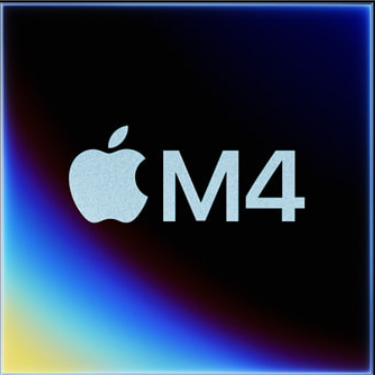
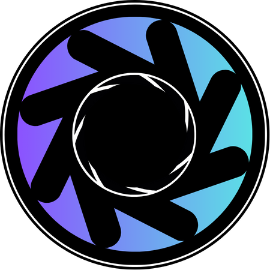

# 👋 Hi, I'm Ace/ATech

Hey! I’m a indie developer who spends most of my time building games, tools, and experimental software. I enjoy working close to the code—designing systems, solving technical problems, and iterating on ideas until they work well. I primarily work in C++ and general software development, with experience across game logic, tooling, input systems, and performance-conscious design.

<h2> 🚀 &nbsp;My Tech & Tools</h2>

<!-- IDEs of Choice -->
<h3>💻 IDEs of Choice</h3>

  
  
  

<!-- Hardware of Choice -->
<h3>💾 Hardware of Choice</h3>

  
  
  
          

<!-- Software of Choice -->
<h3>🛠️ Software of Choice</h3>

  
  
  
  
  

<!-- Main Languages -->
<h3>🧠 Main Languages</h3>

   
  

<!-- Other Languages -->
<h3>📚 Other Languages</h3>

  
  

<!-- Languages I Want to Learn -->
<h3>🌱 Languages I Want to Learn</h3>

  
  
  

  

---

## 🏆 What I Do

- **C++ Applications** — My go-to language for building performance-focused applications.
- **IT / Backend Development** — My primary specialization. I work mainly with Python and Node.js to build robust server-side applications.
- **Web Development** — The core of many of my projects and where most of my day-to-day work happens.
- **C# (Limited Use)** — Enough to wire up simple Unity interactions, but not a primary focus.

---

## 🚀 Featured Projects

These are my favorite projects, I still want to keep improving on them to this day. If you have any ideas, feel free to send a PR!

### [Omnix](https://github.com/Ace-codes-swift/Omnix)
>A macOS-native everything-3D creation studio featuring a modular workspace, polyglot scripting hooks, and immersive viewport tooling.

### [AI Warehouse Soccer (aiw_soccer)](https://github.com/DQN-Labs/aiw_soccer)
> Community-powered, interactive soccer game experience for the official AI Warehouse videos. Play, contribute, and see how RL powers a team on the (virtual) field!

---

## 🌎 Connect with Me

- 📧 Email: acesontechnologies@gmail.com
- 💬 [Discord Server](https://discord.gg/n5CXzuYr)

---

